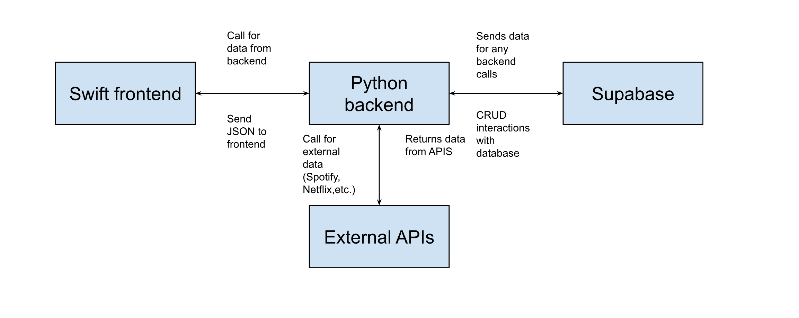

# Rankd

**Rankd** is a ranking and recommendation mobile app that allows users to rank items in various categories—including albums, movies, TV shows, video games, and restaurants—using a pairwise comparison algorithm similar to dating apps. The app uses API integrations to provide personalized recommendations based on user preferences and trends.


---

## Components


### 1. Frontend (React Native App)
- **Functionality:**  
  - Provides the user interface for ranking items, viewing recommendations, and browsing rankings.  
  - Handles user interactions and state management.  
- **Programming Language:** Typescript
- **Major Libraries/Frameworks:**  
  - React Native
  - React Navigation
  - Axios
  - Expo Router
- **Testing Methodology:**  
  - React Native Testing Library 
- **Interactions:**  
  - Communicates with the backend API to fetch and submit ranking data.

### 2. Backend (FastAPI Server)
- **Functionality:**  
  - Processes ranking data, stores user preferences, and serves recommendations.  
  - Implements the pairwise comparison algorithm and recommendation logic.  
- **Programming Language:** Python (FastAPI)  
- **Major Libraries:**  
  - FastAPI  
  - Pydantic (data validation)  
- **Testing Methodology:**  
  - Pytest for unit and integration tests  
  - Postman for manual API testing  
- **Interactions:**  
  - Serves JSON data to the frontend  
  - Interfaces with the database for storage and retrieval

### 3. Database (Supabase – PostgreSQL Cloud Storage)
- **Functionality:**  
  - Stores user profiles, rankings, categories, and API-fetched item data.  
- **Programming Language:** SQL (PostgreSQL)  
- **Major Libraries/Tools:**  
  - Supabase Python client  
- **Testing Methodology:**  
  - Schema validation  
  - Query benchmarking  
- **Interactions:**  
  - Backend connects to Supabase for all CRUD operations

### 4. External APIs (Spotify, Yelp, IMDB, etc.)
- **Functionality:**  
  - Fetches metadata and content for ranking categories (e.g., album details, restaurant info, movie metadata).  
- **Programming Language:** N/A (RESTful API calls)  
- **Major Libraries/Tools:**  
  - Frontend: fetch/axios/Next.js API routes  
  - Backend: `requests` library  
- **Testing Methodology:**  
  - Mock API responses in Postman  
- **Interactions:**  
  - Backend services call external APIs, process responses, and store relevant data in the database

---

## Getting Started

1. **Clone the repo:**  
   ```bash
   git clone https://github.com/your-org/rankd.git
   cd rankd

2. **Start Backend Server**
   python -m uvicorn app:app --host 0.0.0.0 --port 8001

3. **Run Expo Server**
   npx expo start


